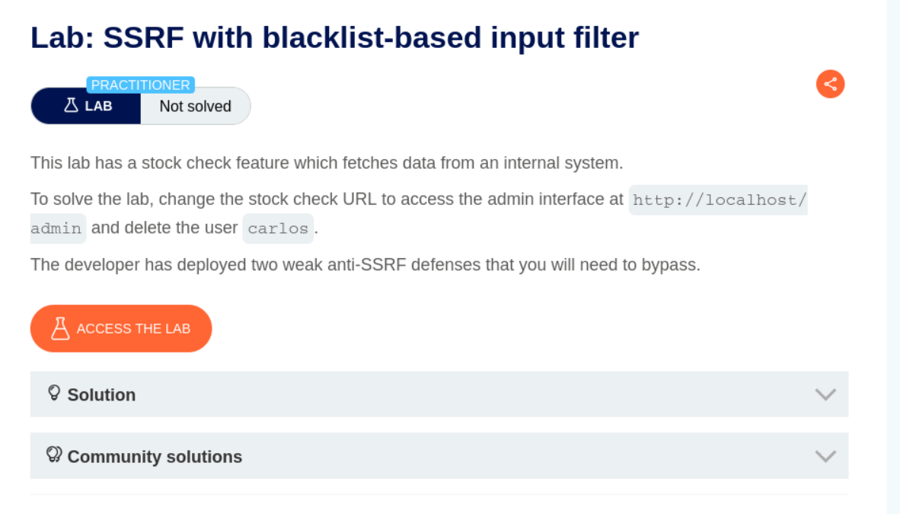
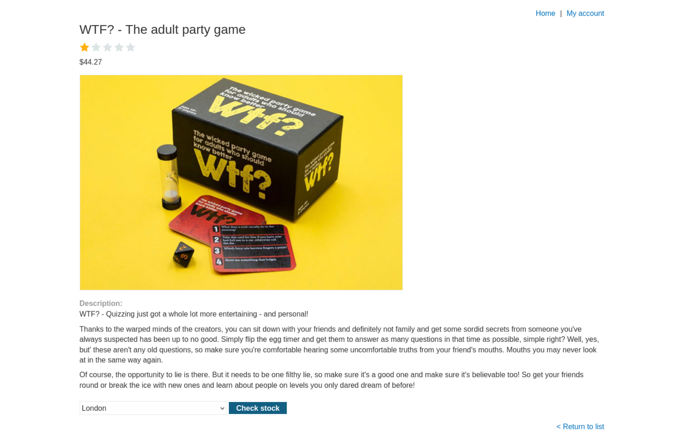
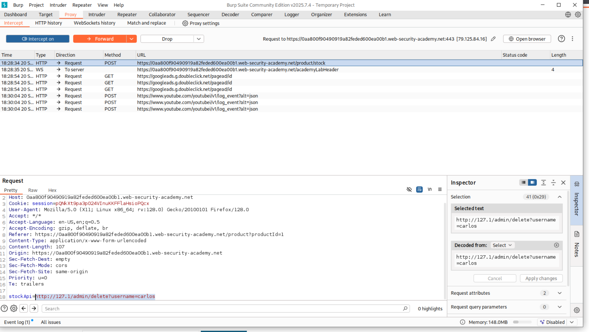
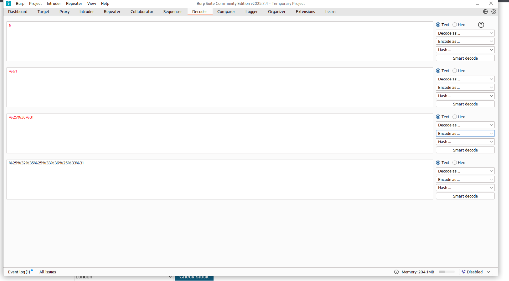
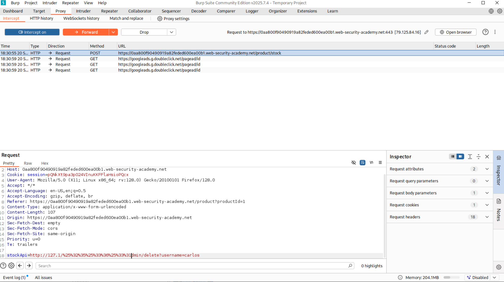
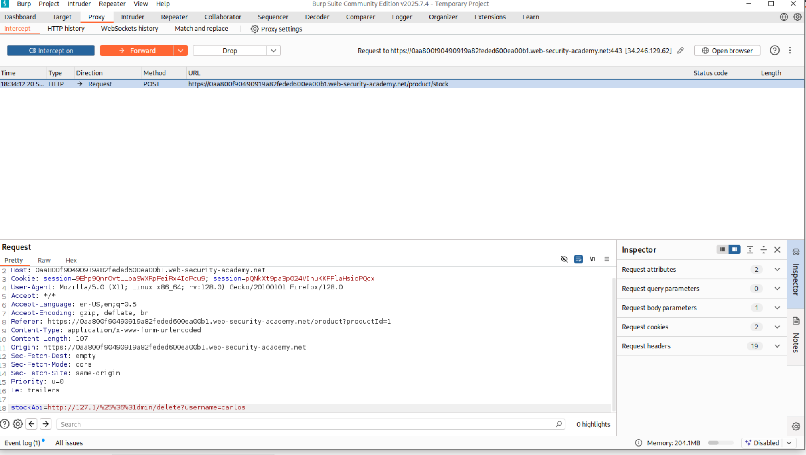
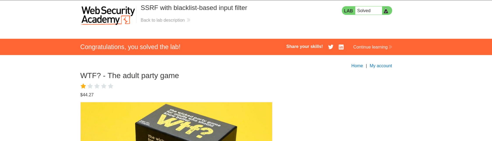

1. Lab Hedefinin Anlaşılması:   
Hedef: Labın temel amacı, stok kontrol özelliğindeki SSRF zafiyetini kullanarak, karaliste tabanlı filtrelemeyi atlatmak ve dahili yönetici arayüzü olan http://localhost/admin adresine erişmektir.  
Son İşlem: Yönetici arayüzüne ulaşıldıktan sonra, carlos kullanıcısının silinmesini sağlayan komutu tetiklemektir.  
Arayüz:   
Lab'a erişim sağlandığında, "WTF? - The adult party game" ürününün detay sayfası görülür. Sayfanın alt kısmında, zafiyetin bulunduğu potansiyel nokta olan "Check stock" (Stok Kontrol) düğmesi yer almaktadır.  
Aşama 2: İstek Yakalama ve Payload Hazırlığı  
Burp Suite:   
Ürün sayfasında "Check stock" işlemi tetiklendiğinde, Burp Suite'in Proxy -> Intercept sekmesinde bir POST isteği yakalanır. Bu istekte, sunucunun dahili bir sistemden stok bilgisini çektiği StockApi: parametresi görülmektedir.  
Bu aşamada, zafiyetin sömürülmesi için hedef URL http://127.0.0.1/admin/delete?username=carlos olarak ayarlanmıştır.  
Filtre Atlama:   
Black-list filtrelemesini atlatmak için URL Kodlama (Encoding) teknikleri denenmiştir. Fotoğrafta, Burp Decoder sekmesi kullanılarak / gibi kritik karakterlerin çift URL kodlama ile (%2f $\to$ %252f) filtreyi nasıl atlayacağı araştırılmıştır.  
Bu, filtrenin sadece tekil kodlanmış tehlikeli karakterleri algıladığı varsayımına dayanır.  
Aşama 3: Saldırı Payload'unun Gönderilmesi  
Payload:   
Bu fotoğraf, saldırı payload'unun son halini gösterir. Burp Suite'in Proxy ekranında yakalanan POST isteğinin gövdesindeki StockApi: parametresi, lab hedefini gerçekleştiren URL ile değiştirilir: http://127.0.0.1/admin/delete?username=carlos.  
Bu URL, filtrenin atlatıldığı bir formattadır.  
Forward:   
Payload'umuzu forward ediyoruz.  
Tamamlama:   
Değiştirilmiş payload sunucuya iletildikten sonra, sunucu dahili olarak filtreyi atlayarak yönetici arayüzüne istek göndermiştir. Bu istek, carlos kullanıcısını silme işlemini başarıyla gerçekleştirmiştir.
