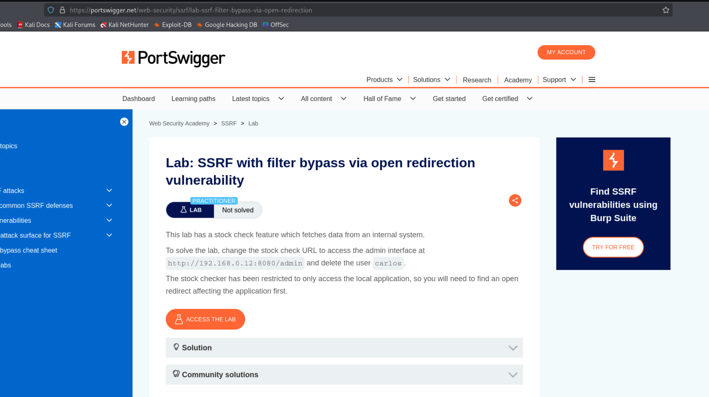
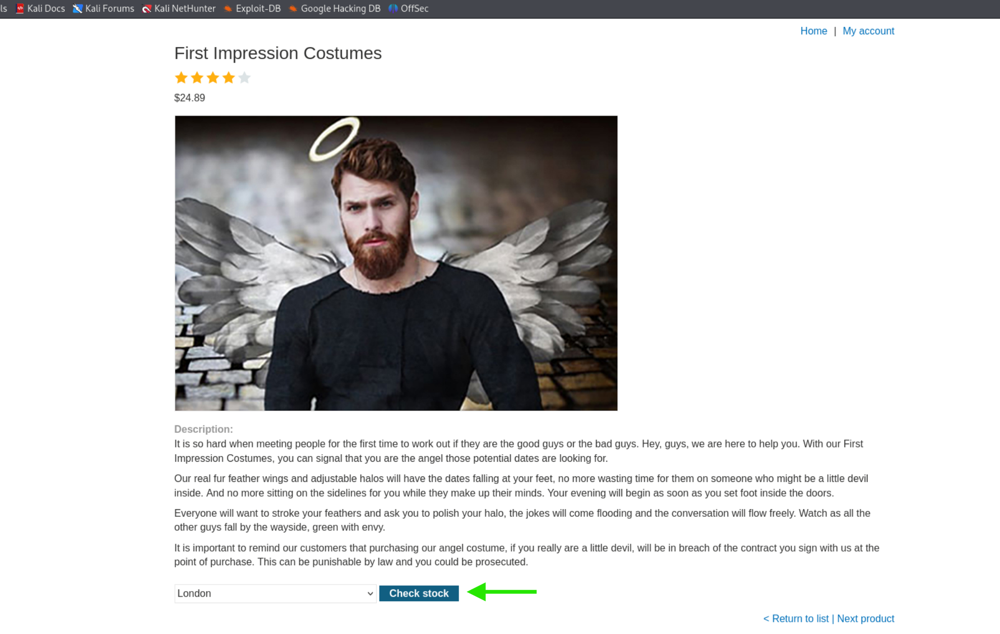
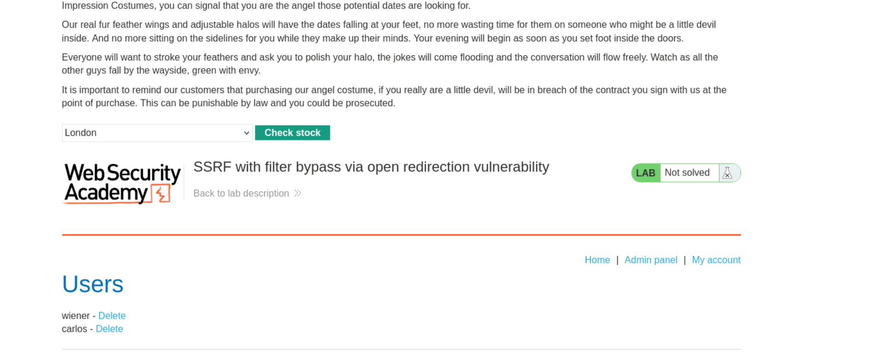
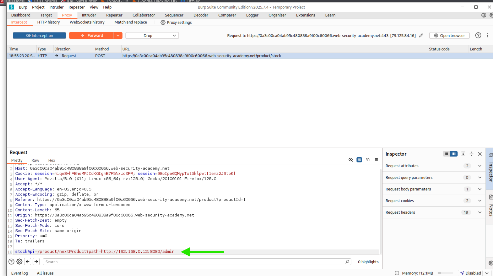
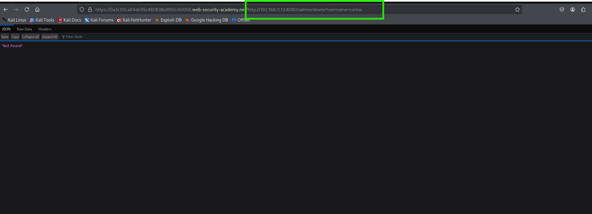
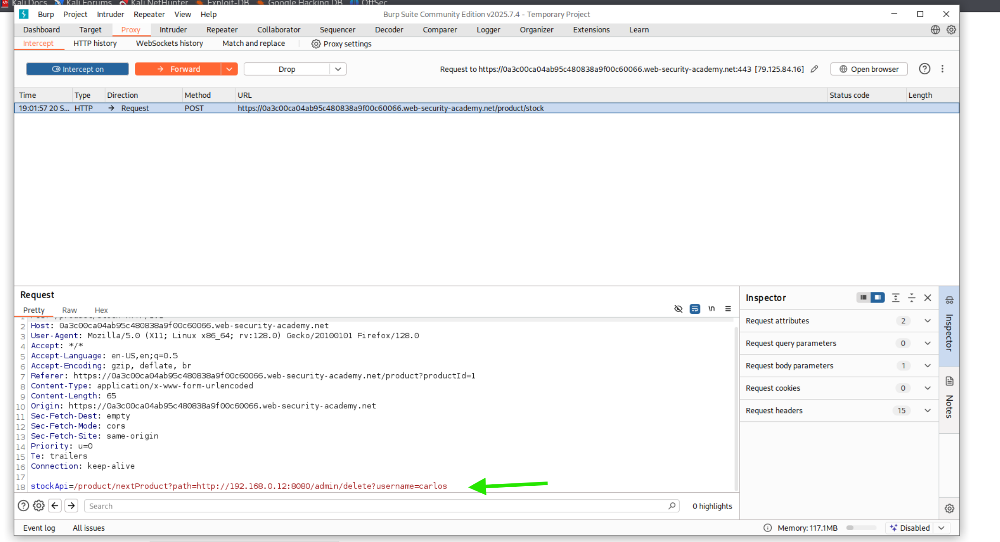

Bu lab, Burp Suite kullanılarak bir web uygulamasındaki açık yönlendirme (Open Redirection) zafiyetini bir SSRF filtresini atlatmak için kullanılmasından ibarettir.  
Aşama 1: Hedef ve Kullanılan Teknik  
Lab Tanımı:   
Bu aşama, çözümün amacını belirtir: Stok kontrol özelliğindeki SSRF zafiyetini kullanarak, dahili adresteki http://192.168.0.12:8080/admin arayüzüne erişmek ve carlos kullanıcısını silmek. Filtre, yalnızca yerel erişime izin verdiği için, bir açık yönlendirme zafiyetinin kullanılması gerekmektedir.  

Aşama 2: Uygulama Arayüzü ve Admin Paneli  
Arayüz:    
"First Impression Costumes" ürün sayfasının altındaki "Check stock" (yeşil ok) düğmesi, sunucu tarafında istek (SSRF) gönderen işlevi tetikleyen noktadır.  

Admin Paneli:    
Lab başlangıcında, yönetici panelinin varlığı, carlos kullanıcısının listelendiği ve labın henüz çözülmediği (LAB Not solved) görülmektedir. Nihai hedef, bu kullanıcıyı silmektir.  

Aşama 3: Saldırı İsteğinin Düzenlenmesi  
Admin Panel Keşfi:    
Burp Suite'te yakalanan POST isteği görülür. StockApi: parametresi, zafiyetin sömürüldüğü alandır. Filtreyi atlamak için, uygulamanın kendi içerisindeki bir açık yönlendirme zafiyeti kullanılır.  

Payload (Keşif Aşaması): stockApi:/product/nextProduct?productId=1&path=http://192.168.0.12:8080/admin (Yeşil ok, payload'un başlangıçta admin panelini hedef aldığını gösterir). Bu payload, sunucuyu önce kendi üzerindeki bir yönlendirme endpoint'ine, oradan da kısıtlı dahili adrese yönlendirir.  

Denemeler:    
Tarayıcıda doğrudan denenen bir URL'yi gösterir. Buradaki http://192.168.0.12:8080/admin/delete?username=carlos adresi dışarıdan erişilemediği için tarayıcıda "Not Found" (veya benzeri bir hata) dönebilir. Bu fotoğraf, dahili adresin harici erişime kapalı olduğunu teyit eder.  

Aşama 4: Nihai Sömürü ve Kullanıcı Silme  
Payload:    Keşif sonrası, carlos kullanıcısını silmek için payload güncellenir.  

Nihai Payload: stockApi:/product/nextProduct?productId=1&path=http://192.168.0.12:8080/admin/delete?username=carlos (Yeşil ok).  

Bu istek, Burp'te "Forward" edilerek sunucuya gönderilir. Sunucu, açık yönlendirme zafiyetini takip ederek dahili IP adresine ulaşır ve carlos kullanıcısını siler.  

Aşama 5: Labın Başarıyla Çözülmesi  
Finish:   
Nihai isteğin gönderilmesinin ardından, lab hedefine ulaşıldığı görülür.
