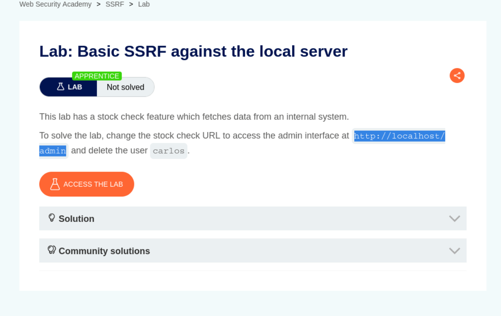
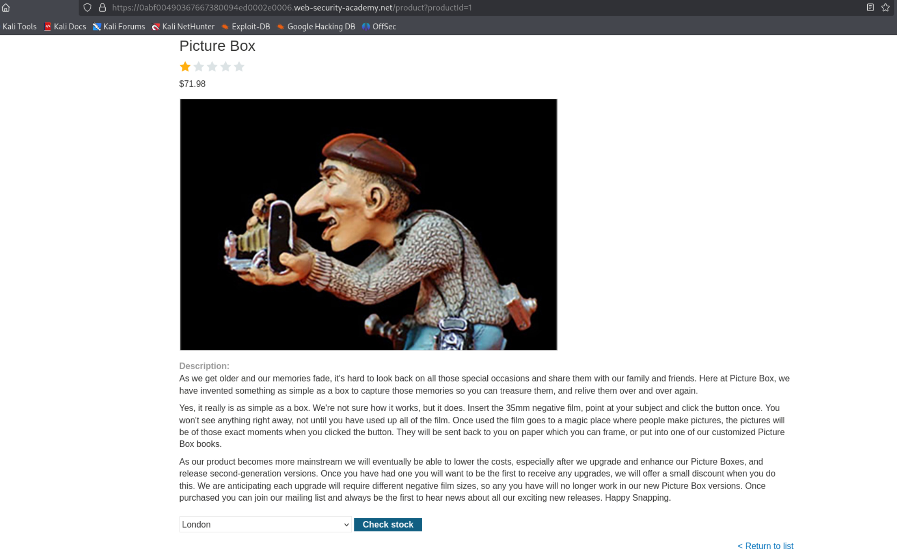
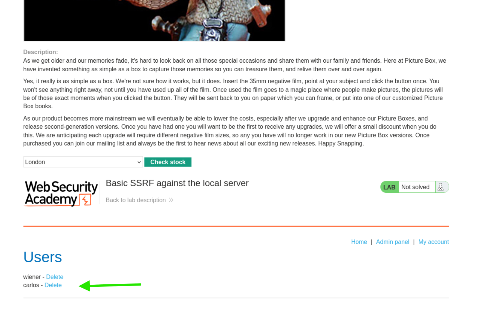
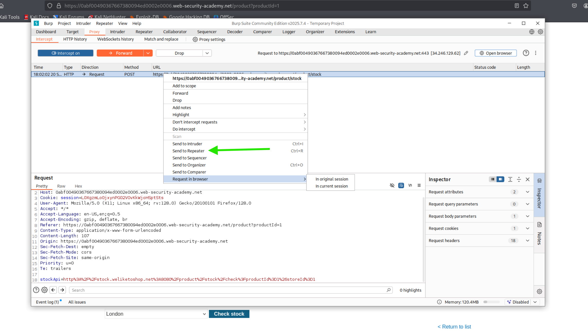
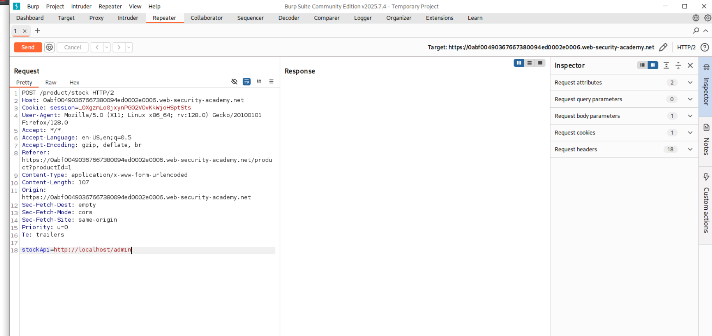
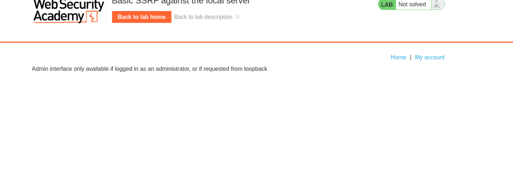
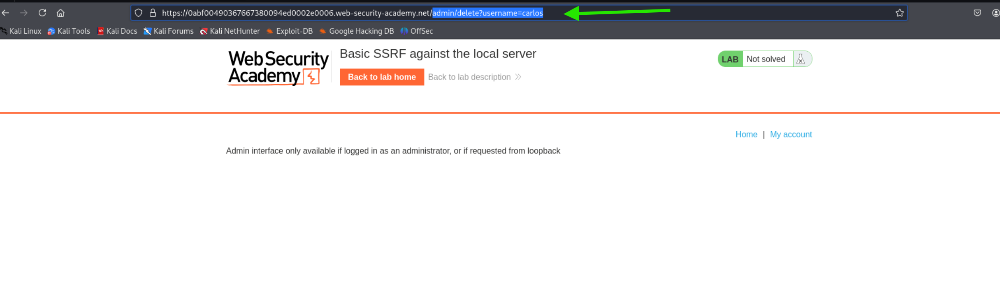
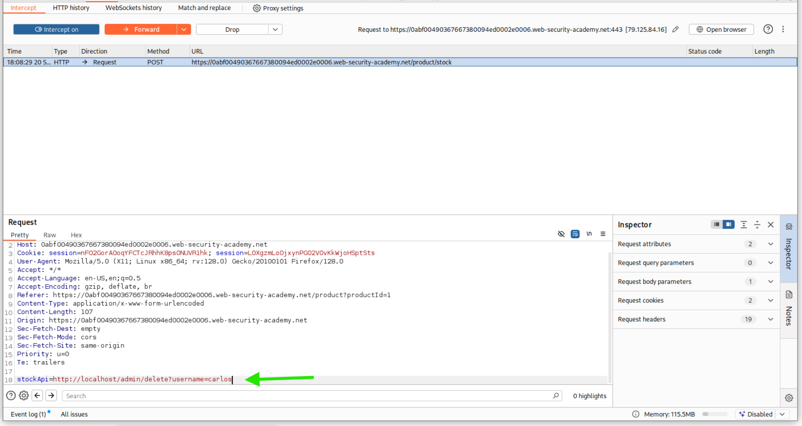
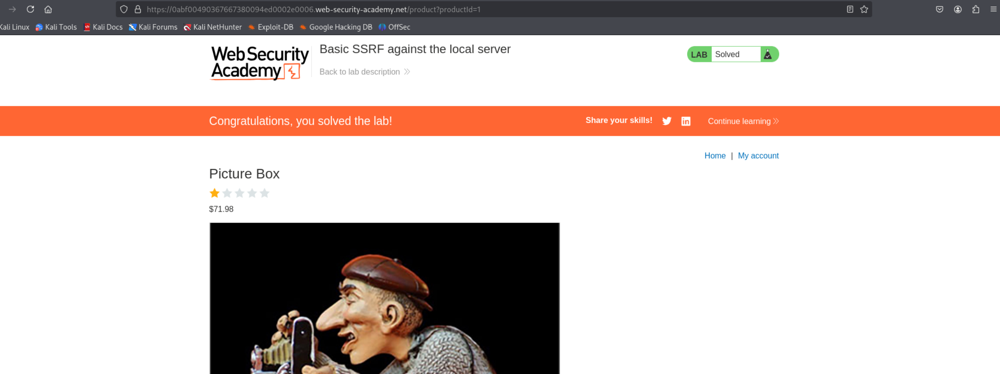

Amaç, stok kontrol işlevi üzerinden localhost adresine istek göndererek yetkilendirme kontrolünü atlamaktır.  

Aşama 1: Hedefin Belirlenmesi
Açıklama:   
Lab'ın temel SSRF saldırısı hakkında genel bilgi ve labın durumunu (Not solved) gösterir. Saldırı, bir URL belirtilerek stok durumu isteyen bir işlevi sömürmeyi amaçlar.  

Hedef:   
Stok kontrol URL'sini http://localhost/admin olarak değiştirmek ve carlos kullanıcısını silmektir.  

Arayüz:   
Ürün sayfasında (Picture Box) bulunan ve SSRF zafiyetine yol açan "Check stock" düğmesi görülmektedir.  

Admin Paneli:   
Sayfanın alt kısmında, yetkili olunmadığı için erişilemeyen veya görünmeyen Yönetici Paneli'nin bir kısmı ve silinmesi gereken carlos kullanıcısı listelenir.  

Aşama 2: İstek Yakalama ve Repeater'a Gönderme  
Burp Intercept:    Burp Suite ile stok kontrolünü tetikleyen POST isteği yakalanır. İstek, işleme kolaylığı ve tekrar denemeler için "Send to Repeater" (Yeşil ok) seçeneği ile Repeater sekmesine yönlendirilir.  

Aşama 3: Dahili Adrese Erişim Denemesi  
Burp Repeater - Panel:   
İstek Repeater sekmesine taşınmıştır. SSRF zafiyetinin bulunduğu stockApi: parametresi değiştirilerek yönetici arayüzüne erişim denenir.  

Payload: stockApi:http://localhost/admin  

Amaç: Bu istek, sunucunun dahili olarak localhost adresine bağlanmasını sağlayarak, genellikle sadece yerel döngü (loopback) üzerinden gelen isteklere güvenen güvenlik mekanizmasını atlamayı hedefler.  

Admin Paneli:   
http://localhost/admin adresine erişim sağlandıktan sonra, eğer admin arayüzü sadece yönetici olarak oturum açılmışsa veya loopback'ten istenmişse erişilebilirse, bu fotoğraf dönebilir ve admin arayüzünün varlığını doğrular.  

Aşama 4: Nihai Sömürü ve Kullanıcı Silme  
Silme Denemesi:   
Bu fotoğraf, tarayıcıda doğrudan admin silme komutunun denenmesini gösterir (/admin/delete?username=carlos). Bu dışarıdan erişilemez ve lab hedefine ulaşmak için SSRF kullanılmalıdır.  

Silme Payload'u:   
Çözüm için Burp Intercept sekmesinde (veya Repeater'da) nihai payload hazırlanmıştır.  

Nihai Payload: stockApi:http://localhost/admin/delete?username=carlos (Yeşil ok ile gösterilen kısım).  

Bu istek sunucuya gönderildiğinde, sunucu dahili olarak localhost adresindeki admin paneline erişir ve carlos kullanıcısını silme işlemini gerçekleştirir.  

Aşama 5: Bitiş  
Finish:  
