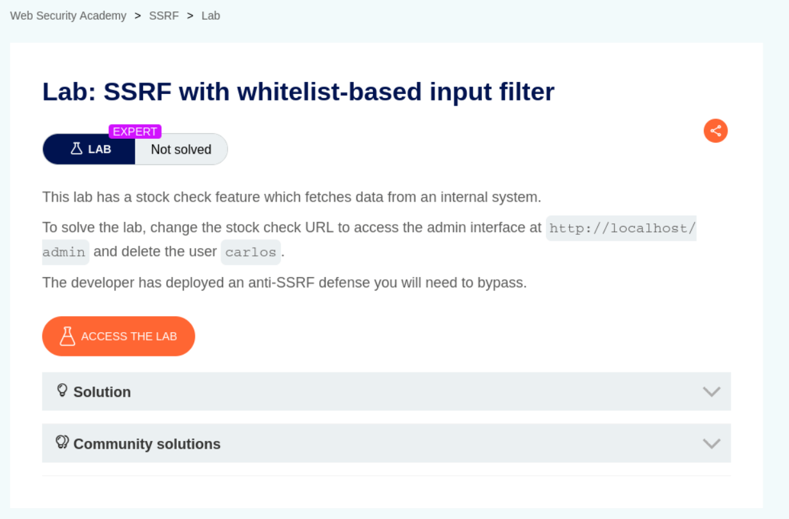
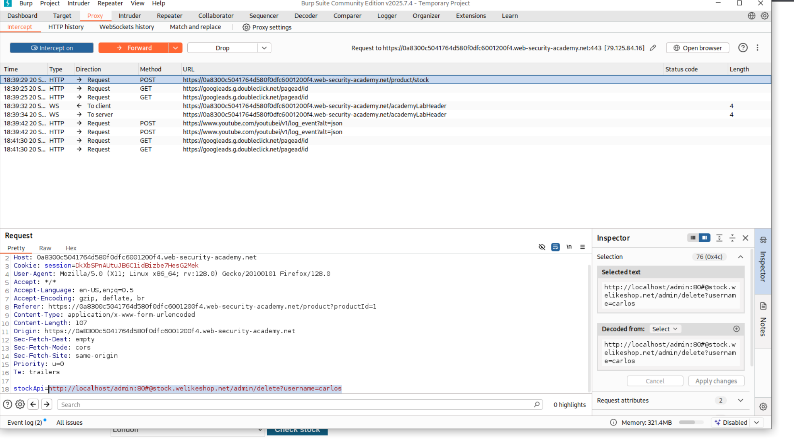
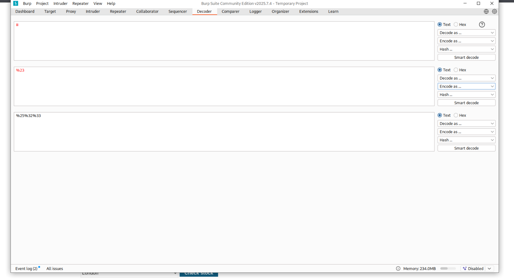
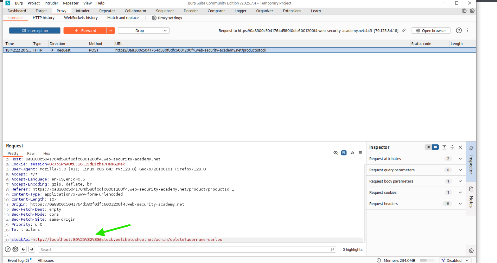
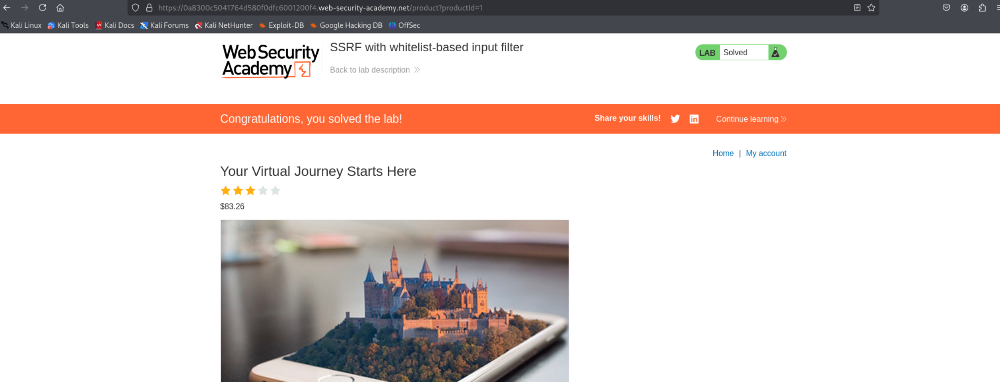

Bu, daha önce çözdüğünüz karaliste tabanlı filtreleme labına benzeyen, ancak bu sefer beyaz liste Açıklama: (whitelist) tabanlı filtrelemeyi atlatmayı gerektiren bir lab çözümüdür.  
Aşama 1: Hedefin Belirlenmesi  
Tanım:    
Çözümün hedefi, stok kontrol özelliğindeki SSRF zafiyetini kullanarak, dahili adresteki http://localhost/admin arayüzüne erişmek ve carlos kullanıcısını silmektir. Bu lab'da, geliştiricinin uyguladığı anti-SSRF savunması bir beyaz liste olduğu için, filtreyi atlatmak daha zorlu bir teknik gerektirecektir.  

Aşama 2: Intercept ve White-list Tespiti
Burp Suite:   
Burp Suite'in Proxy -> Intercept sekmesinde, stok kontrolünü tetikleyen POST isteği yakalanmıştır. Bu istekte, SSRF zafiyetinin bulunduğu stockApi: parametresi görülür.  

White-list Atlama Stratejisi: white-list filtreleri genellikle sadece belirli host adlarına (örneğin, stock.welikeshop.net) izin verir. Filtreyi atlatmak için, hem beyaz listedeki geçerli bir host adını hem de asıl hedef olan localhost adresini içeren karma bir URL oluşturulmalıdır.  

Deneme Payload'u (Fotoğrafta Görünür): stockApi:http://localhost/admin/delete?username=carlos (Bu payload, filtrenin sadece http://localhost kısmını kontrol etmesi durumunda ilk deneme olabilir).  

Aşama 3: Filtre Atlama Tekniklerinin Uygulanması  
Burp Decoder:   
White-list filtrelemesini atlatmak için farklı kodlama teknikleri (örneğin, # karakterinin URL kodlaması) denenmiştir. # karakteri URL'de bir fragment (parça) belirteci olarak kullanılır ve sunucu isteği işlerken genellikle bu kısmı yok sayar. Ancak, white-list kontrolü bazen # karakterinden önceki kısmı kontrol eder.  

Önemli Teknik (Atlatma): Beyaz listedeki domain adını (stock.welikeshop.net) kullanarak ve localhost adresini bu domainin hemen yanına, # karakterini kullanarak yerleştirme tekniği uygulanır.  

Örnek Vektör: http://localhost#stock.welikeshop.net/admin/delete?username=carlos  

Aşama 4: Nihai Saldırı Payload'unun Gönderilmesi  
Payload:   
White-list'i atlatmayı sağlayan nihai payload hazırlanmış ve Burp Proxy'de ayarlanmıştır. Bu teknik, URL ayrıştırmasındaki (parsing) bir tutarsızlığa dayanır.  

Gönderilen Payload: stockApi:http://localhost%23stock.welikeshop.net/admin/delete?username=carlos  

Açıklama:  

URL'nin büyük bir kısmı stock.welikeshop.net ile bitmektedir.  

Ancak # karakteri URL kodlanarak %23 olarak gönderilmiştir.  

Filtre Mekanizması: Filtre, isteği stock.welikeshop.net ile biten geçerli bir URL olarak görerek kabul eder.  

HTTP Kütüphanesi: Sunucudaki HTTP isteği yapan kütüphane ise %23 kodunu # olarak çözer ve URL'yi parçalar. # karakteri bir fragment (parça) olarak kabul edildiği için, bu kısımdan sonraki her şeyi (yani stock.welikeshop.net/admin/delete?username=carlos kısmını) yoksayar.  

Sonuç: HTTP isteği http://localhost adresine gönderilmiş olur, böylece kısıtlı dahili adrese başarılı bir erişim sağlanır ve carlos kullanıcısı silinir.  

Aşama 5: Labın Başarıyla Çözülmesi  
Finish:    
